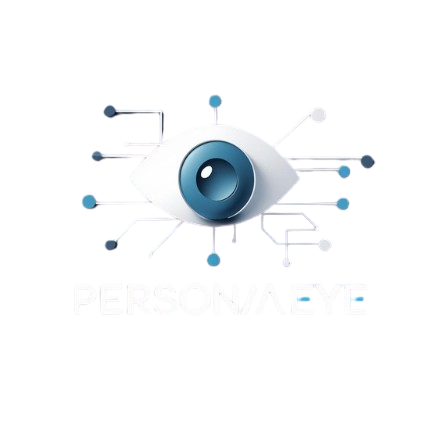

# PersonaAEye 🚀🤖

**PersonaAEye** is an intelligent, real-time digital assistant—designed for users who seek AI-powered productivity, coding support, creative exploration, and seamless chat interaction. It blends the power of modern web tech with the simplicity of a user-first design.

---

## 🌟 About PersonaAEye

PersonaAEye is your intelligent assistant—built by a self-taught front-end developer with a passion for AI, real-time interfaces, and beautiful web experiences.

It’s more than just a chatbot. It’s a personal assistant, AI companion, and productivity enhancer—crafted with precision, animation, and care.

---

## 🎯 Our Mission

> To empower users through intelligent, responsive, and personalized AI interactions.

Whether you're a:
- 🧑‍🎓 Student
- 👨‍💻 Developer
- 🤖 AI enthusiast
- 💬 Curious explorer

**PersonaAEye is here to assist, respond, and grow with you.**

---

## 👨‍💻 Who's Behind PersonaAEye?

> My name is **Hassaan Haider**. I'm a self-taught front-end developer with 2+ years of experience building elegant, animated, and interactive UIs using:
- **React**
- **Tailwind CSS**
- **JavaScript**

I've worked with backend tools like:
- **Express.js**
- **MongoDB**
- **EJS**
- **GSAP**

From Pinterest clones and social tools to AI agents and video downloaders—PersonaAEye is the result of everything I’ve built and imagined.

---

## 🧠 Tech Stack

- **Frontend**: React, Tailwind CSS, Zustand, GSAP
- **Backend**: Express.js, Node.js, MongoDB
- **Storage & Deployment**: Cloudinary (media), Vercel (hosting)
- **AI Logic**: Custom role-based response engine (LLM-ready)

---

## ⚙️ Features

- 💬 Smart local replies to basic greetings
- ⏱ Real-time chat interface with animated scroll-to-bottom
- 🧠 Role-based personalized AI responses
- 🎭 Smooth UI transitions and flows via GSAP
- 🤖 Upcoming Telegram bot integration

---

## 📌 Quote

> _"PersonaAEye is more than just a tool—it's your AI-powered companion in the world of code, creativity, and curiosity."_  
— **Hassaan Haider**, Creator of PersonaAEye

---

## 📷 Preview



---

## 🏁 Getting Started

Clone the project and install dependencies:

```bash
git clone https://github.com/yourusername/personaaeye.git
cd personaaeye
npm install
npm run dev
